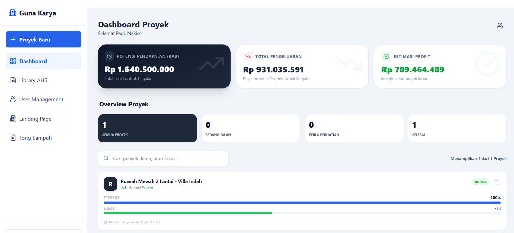
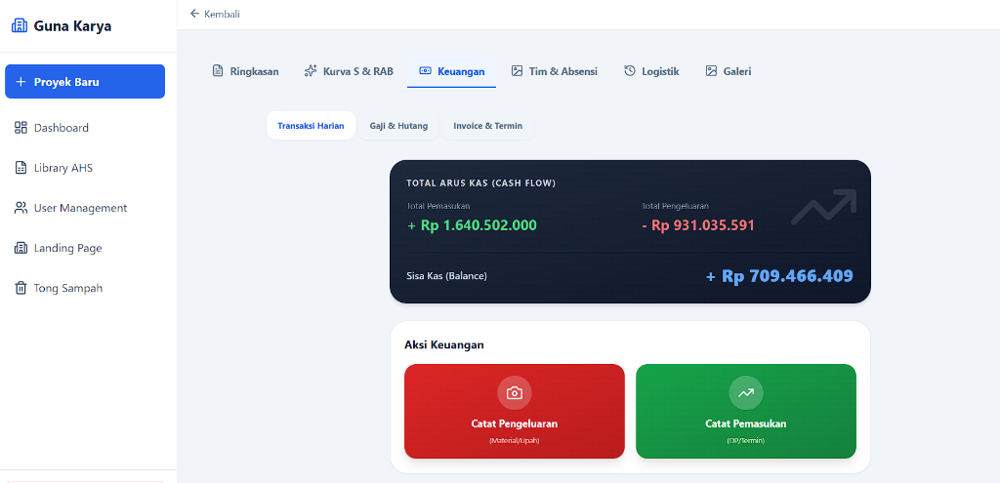
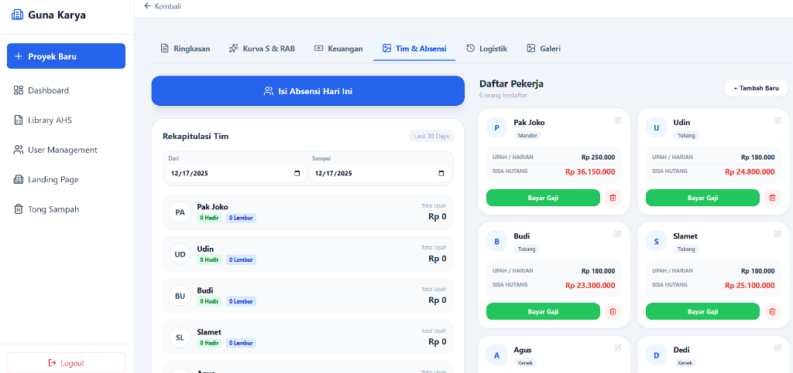
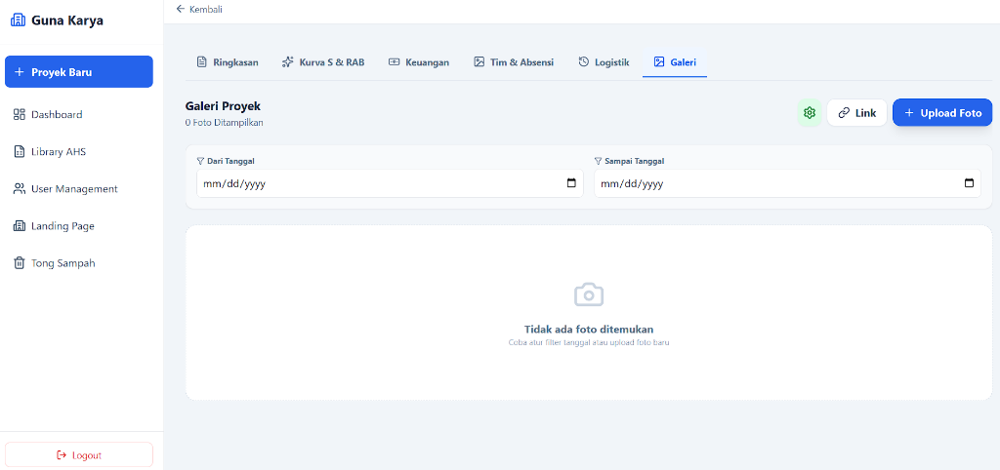
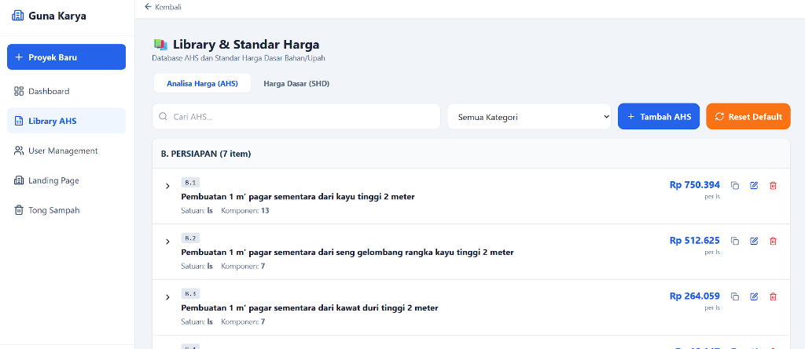
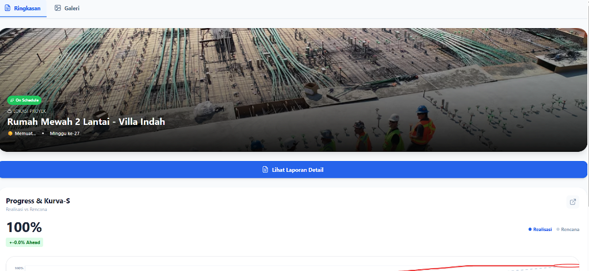
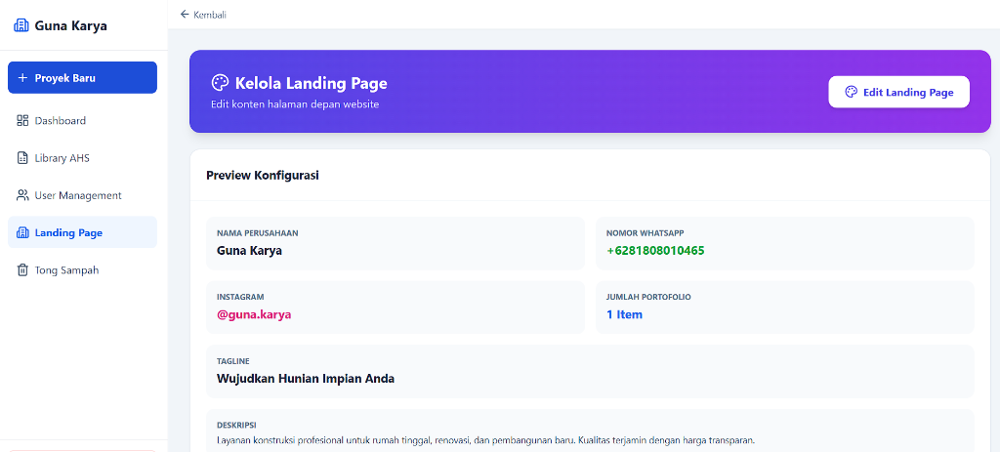
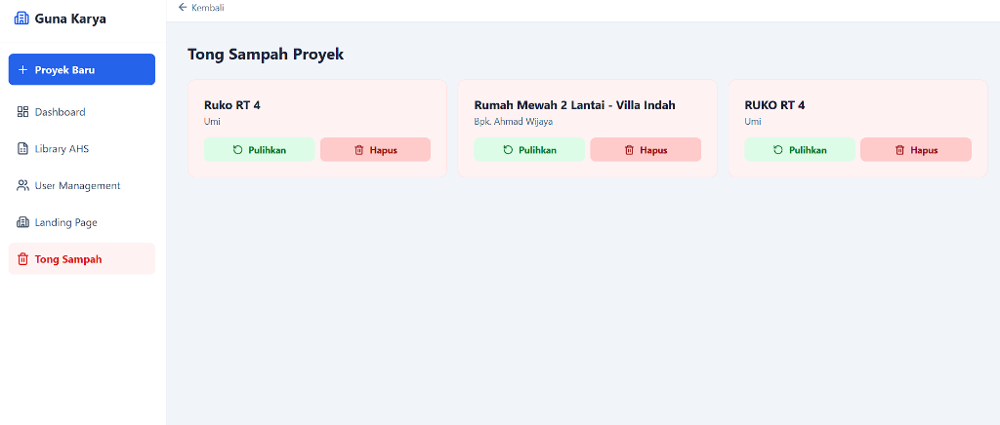

# 📘 Manual Penggunaan Aplikasi Kontraktor Pro

Selamat datang di **Kontraktor Pro** (Guna Karya), solusi manajemen konstruksi cerdas berbasis web. Dokumen ini memandu Anda menggunakan fitur-fitur unggulan aplikasi.

**Versi Dokumentasi:** 2.0 (Desember 2024)

---

## 📋 Daftar Isi

1. [Login & Autentikasi](#1-login--autentikasi)
2. [Dashboard Proyek](#2-dashboard-proyek)
3. [Detail Proyek](#3-detail-proyek)
4. [Manajemen RAB & Kurva S](#4-manajemen-rab--kurva-s)
5. [Keuangan (Pemasukan & Pengeluaran)](#5-keuangan-pemasukan--pengeluaran)
6. [Manajemen Tukang & Absensi](#6-manajemen-tukang--absensi)
7. [Logistik & Stok Material](#7-logistik--stok-material)
8. [Galeri Proyek](#8-galeri-proyek)
9. [Library AHS (Analisa Harga Satuan)](#9-library-ahs-analisa-harga-satuan)
10. [Portal Klien](#10-portal-klien)
11. [Manajemen User](#11-manajemen-user)
12. [Landing Page CMS](#12-landing-page-cms)
13. [Tong Sampah](#13-tong-sampah)
14. [Landing Page (Public)](#14-landing-page-public)

---

## 1. Login & Autentikasi

*Screenshot: Halaman login Google*

### Cara Login:
1. Buka aplikasi di browser
2. Klik tombol **"Login dengan Google"**
3. Pilih akun Google yang sudah terdaftar di sistem

### Catatan Penting:
- Hanya user yang sudah didaftarkan oleh Super Admin yang bisa login
- User pertama yang login akan otomatis menjadi Super Admin
- Jika belum terdaftar, akan muncul pesan error

---

## 2. Dashboard Proyek

Halaman utama adalah pusat kendali bisnis Anda.

### Fitur Utama:
- **Daftar Proyek**: Kartu ringkasan untuk setiap proyek aktif
- **Status Progress**: Bar hijau menunjukkan realisasi fisik di lapangan
- **Indikator Keuangan**: Bar yang membandingkan budget vs pengeluaran aktual (Merah = Overbudget)
- **Cuaca Live**: Ikon cuaca di kartu proyek membantu memutuskan jadwal pekerjaan outdoor

### Aksi Tersedia:
- ➕ **Proyek Baru**: Tombol di pojok kanan atas untuk membuat proyek baru
- 👁️ **Lihat Detail**: Klik kartu proyek untuk masuk ke manajemen lengkap
- 🔗 **Portal Klien**: Bagikan link ke owner untuk monitoring

---

## 3. Detail Proyek

Setelah klik proyek, Anda masuk ke halaman detail dengan beberapa tab:

### Tab yang Tersedia:
| Tab | Fungsi |
|-----|--------|
| **Overview** | Ringkasan proyek, statistik, dan alur navigasi cepat |
| **RAB** | Rencana Anggaran Biaya & Kurva S |
| **Keuangan** | Pemasukan, Pengeluaran, Cashflow |
| **Tukang** | Daftar pekerja, absensi, payroll |
| **Logistik** | Stok material & order |
| **Galeri** | Foto-foto progress proyek |

---

## 4. Manajemen RAB & Kurva S

### Cara Membuat RAB:

#### A. Tambah Item Manual
1. Klik tombol **+ Item**
2. Pilih kategori (misal: Pekerjaan Dinding)
3. Isi nama pekerjaan, satuan, volume, dan harga satuan
4. Klik **Simpan**

#### B. Import dari Excel
1. Klik tombol **Import**
2. Download template terlebih dahulu
3. Isi data di Excel sesuai format
4. Upload file

#### C. Generate dengan AI
1. Klik tombol **Auto RAB (AI)**
2. Ketik deskripsi proyek (contoh: *"Rumah Type 36, 2 Kamar Tidur"*)
3. AI akan menyusun item pekerjaan standar

### Kurva S Otomatis:
- Grafik Rencana vs Realisasi diupdate otomatis
- Update progress per item dengan klik tombol **Update Progress**
- Progress tercermin di Kurva S tanpa rumus Excel

### Atur Jadwal Pekerjaan:
1. Klik ikon kalender di tiap item RAB
2. Set tanggal mulai dan selesai
3. Jadwal akan tampil di timeline

---

## 5. Keuangan (Pemasukan & Pengeluaran)

### A. Catat Pemasukan (Dana Masuk)
1. Klik tombol **+ Pemasukan**
2. Pilih kategori: Termin, DP, Pelunasan, atau Tambahan
3. Isi nominal dan tanggal
4. **(Opsional)** Upload bukti transfer/mutasi bank
5. Klik **Simpan Pemasukan**

### B. Catat Pengeluaran (Dana Keluar)
1. Klik tombol **+ Pengeluaran**
2. Pilih kategori: Material, Upah Tukang, Operasional, Sewa Alat, Lainnya
3. Isi nominal, tanggal, dan keterangan
4. **(Opsional)** Upload foto struk/nota sebagai bukti
5. Klik **Simpan Pengeluaran**

### Upload Bukti Transaksi:
- Foto bukti di-upload ke Google Drive (via Apps Script)
- Preview foto muncul sebelum menyimpan
- Bisa hapus foto jika salah pilih dengan klik tombol X
- Bukti bisa dilihat di detail transaksi nanti

### Invoice Generator:
- Buat tagihan termin untuk klien
- Format PDF profesional
- Otomatis hitung berdasarkan progress RAB

---

## 6. Manajemen Tukang & Absensi

### A. Tambah Pekerja
1. Klik **+ Tukang Baru**
2. Isi nama, role (Tukang/Kuli/Mandor/Kepala Tukang)
3. Isi upah asli (rate internal) dan upah mandor (rate charge ke klien)
4. Pilih sistem upah: Harian, Mingguan, Bulanan, atau Borongan

### B. Absensi Harian
1. Klik tombol **Absensi Hari Ini**
2. Pilih tanggal
3. Set status tiap pekerja: Hadir (1), Setengah (0.5), Lembur (1.5), Absen (0)
4. **WAJIB**: Upload foto bukti lapangan (kamera otomatis terdeteksi)
5. **WAJIB**: Lokasi GPS otomatis tercatat
6. Klik **Simpan Absensi**

### C. Fitur Anti-Manipulasi:
- Foto bukti wajib diupload
- Lokasi GPS wajib terdeteksi
- Lokasi bisa diklik untuk buka Google Maps
- Timestamp tercatat otomatis

### D. Payroll Summary:
- Lihat rekap gaji per periode
- Hitung otomatis berdasarkan jumlah hadir x rate
- Export ke PDF

---

## 7. Logistik & Stok Material

### A. Stok Lapangan
1. Klik **+ Material Baru** untuk tambah item
2. Isi nama material, satuan, stok minimum
3. Update stok dengan tombol **Update Stok** (Barang Masuk / Keluar)

### B. Peringatan Stok:
- Kartu berwarna **MERAH** jika stok di bawah minimum
- Notifikasi "STOK MENIPIS" muncul otomatis

### C. Order via WhatsApp:
1. Klik **Order via WhatsApp** pada material yang menipis
2. Masukkan nama & nomor toko supplier
3. Draft pesanan otomatis dibuat
4. Kirim langsung ke WhatsApp

### D. Rekap Kebutuhan Proyek (Smart Shopping):
1. Klik **Rekap Kebutuhan Proyek**
2. Sistem menghitung total kebutuhan bahan dari RAB + AHS
3. Hasil: daftar belanja lengkap
4. Cetak/Export ke PDF

---

## 8. Galeri Proyek

### Upload Foto Progress:
1. Klik **+ Tambah Foto**
2. Pilih foto dari kamera/galeri
3. Foto di-upload ke Google Drive
4. Progress saat foto diambil tercatat otomatis

### Fitur Galeri:
- Filter berdasarkan tanggal
- Tampilkan progress (%) saat foto diambil
- Bisa dilihat oleh klien via Portal Klien

---

## 9. Library AHS (Analisa Harga Satuan)

### Apa itu AHS?
Analisa Harga Satuan adalah breakdown komponen (bahan + upah) untuk setiap jenis pekerjaan.

### Cara Kelola AHS:
1. Masuk ke menu **Library AHS** dari sidebar
2. **Tambah AHS Baru**: Klik + dan isi komponen
3. **Edit Harga Dasar**: Edit harga bahan/upah di tab Resources

### AI Assistant:
Ketik perintah natural di kolom AI:
- *"Naikkan harga semen jadi 65.000"*
- *"Hapus item batu kali"*
- *"Tambah upah tukang gali 120.000"*

### Smart Sync:
Jika harga dasar berubah, klik **Sync Semua AHS** untuk update semua item RAB di semua proyek.

---

## 10. Portal Klien

Fitur transparansi untuk pemilik proyek.

### Cara Berbagi:
1. Di dashboard, klik tombol **Portal Klien** pada proyek
2. Link unik akan disalin
3. Kirim link via WhatsApp ke pemilik

### Yang Bisa Dilihat Klien:
- ✅ Progress fisik (%)
- ✅ Galeri foto progress
- ✅ Kurva S sederhana
- ❌ Nilai uang/profit kontraktor (DISEMBUNYIKAN)

---

## 11. Manajemen User

*Khusus Super Admin*

### Role yang Tersedia:
| Role | Akses |
|------|-------|
| **Super Admin** | Akses penuh, bisa kelola user |
| **Kontraktor** | Project Manager, lihat keuangan |
| **Pengawas** | Absensi & data tukang saja |
| **Keuangan** | Hanya data keuangan |

### Cara Tambah User:
1. Buka menu **User Management**
2. Klik **+ Tambah User**
3. Masukkan email Google dan pilih role
4. User akan bisa login setelah didaftarkan

---

## 12. Landing Page CMS

*Khusus Admin*

### Yang Bisa Diubah:
- **Nama Perusahaan**: PT/CV yang tampil di kop surat
- **Tagline**: Slogan perusahaan
- **Kontak**: WhatsApp, Instagram
- **Portfolio**: Foto proyek terbaik untuk halaman depan

---

## 13. Tong Sampah

Fitur untuk mengelola proyek yang dihapus.

### Cara Kerja:
- Proyek yang dihapus tidak langsung hilang, tapi masuk ke **Tong Sampah**
- Dari sini bisa dipilih untuk:
  - **Pulihkan**: Kembalikan proyek ke dashboard
  - **Hapus Permanen**: Hapus proyek selamanya

### Akses:
- Klik menu **Tong Sampah** di sidebar
- Hanya Super Admin dan Kontraktor yang bisa mengakses

---

## 14. Landing Page (Public)

Halaman depan website yang dilihat publik/calon klien.

### Fitur:
- **Hero Section**: Tagline dan CTA button
- **Statistik**: Jumlah proyek, tahun pengalaman
- **Tombol Konsultasi**: Link langsung ke WhatsApp
- **Lihat Portfolio**: Gallery proyek selesai

### Cara Edit:
- Konten dikelola melalui **Landing Page CMS** (Section 12)

---

## 📸 Daftar Screenshot Tersedia

Screenshot dokumentasi tersimpan di folder `docs/screenshots/`:

| No | Nama File | Halaman/Fitur |
|----|-----------|---------------|
| 02 | `02_dashboard.png` | Dashboard utama dengan daftar proyek |
| 04 | `04_rab_timeline.png` | Timeline Pekerjaan (Kurva S & RAB) |
| 05 | `05_keuangan.png` | Tab Keuangan dengan Cash Flow |
| 06 | `06_tukang.png` | Tim & Absensi, Daftar Pekerja |
| 07 | `07_logistik.png` | Tab Logistik/Stok Material |
| 08 | `08_galeri.png` | Tab Galeri Proyek |
| 09 | `09_library_ahs.png` | Library & Standar Harga |
| 10 | `10_portal_klien.png` | Portal Klien (View Owner) |
| 11 | `11_user_management.png` | Kelola Akses Pengguna |
| 12 | `12_landing_cms.png` | Kelola Landing Page |
| 13 | `13_tong_sampah.png` | Tong Sampah Proyek |
| 14 | `14_landing_page.png` | Landing Page (Public) |

---

## 🔄 Changelog

### v2.0 (Desember 2024)
- ❌ **Dihapus**: Fitur AI Scan Struk (tidak akurat)
- ✅ **Baru**: Upload bukti transaksi (struk/transfer) ke Google Drive
- ✅ **Perbaikan**: Form transaksi auto-reset setelah simpan
- ✅ **Perbaikan**: Error handling lebih baik di penyimpanan transaksi
- 📚 **Dokumentasi**: Manual lengkap dengan 12 screenshot

### v1.0 (November 2024)
- Rilis awal dengan fitur lengkap

---

*Dibuat oleh Sistem Kontraktor Pro - Guna Karya*
